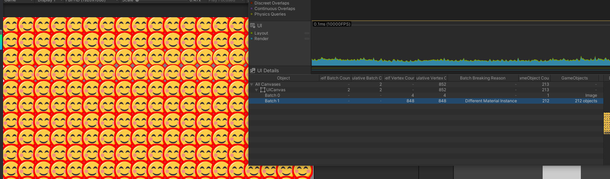

# UXImage

`UXImage` 继承自 Unity `Image`，保留 `sprite`、`type`、`fillAmount`、`preserveAspect`、`raycastTarget`、`maskable` 等原生能力，并额外支持：

- 纯色 / 渐变顶点色
- 水平、垂直、四角镜像绘制
- 图片 `Outline`
- 图片 `Shadow`
- 大半径软阴影 Runtime GPU JFA SDF Cache
- 动态 Sprite 的运行时自动 Atlas / Cache

源码位置：

- `Client/Packages/com.alicizax.unity.ui.extension/Runtime/UXComponent/Image`
- `Client/Packages/com.alicizax.unity.ui.extension/Editor/UX/Image`
- Shader：`Client/Packages/com.alicizax.unity.ui.extension/Runtime/Resources`

## 创建方式

在 Unity 菜单中右键创建：

```text
GameObject/UI/UXImage
```

创建后直接在 Inspector 中设置 `Source Image`、`Image Type`、`Color`、`Outline`、`Shadow` 等属性即可。

`Outline` 和 `Shadow` 不需要手动换 Shader、不需要创建 Material、不需要生成 SDF 图片，也不需要额外的打包流程。

## 基础用法

```csharp
using UnityEngine;
using UnityEngine.UI;

public static class UXImageExample
{
    public static void SetGradient(UXImage image)
    {
        image.m_ColorType = UXImage.ColorType.Gradient_Color;
        image.Direction = UXImage.GradientDirection.Horizontal;

        Gradient gradient = new Gradient();
        gradient.SetKeys(
            new[]
            {
                new GradientColorKey(Color.red, 0f),
                new GradientColorKey(Color.yellow, 1f),
            },
            new[]
            {
                new GradientAlphaKey(1f, 0f),
                new GradientAlphaKey(1f, 1f),
            });

        image.gradient = gradient;
    }

    public static void SetMirror(UXImage image)
    {
        image.flipMode = UXImage.FlipMode.Horziontal;
        image.flipWithCopy = true;
        image.flipEdgeHorizontal = UXImage.FlipEdgeHorizontal.Right;
    }

    public static void SetOutlineAndShadow(UXImage image)
    {
        image.enableOutline = true;
        image.outlineEffectColor = Color.black;
        image.outlineEffectDistance = new Vector2(2f, 2f);
        image.outlineSoftness = 0.5f;

        image.enableShadow = true;
        image.shadowEffectColor = new Color(0f, 0f, 0f, 0.45f);
        image.shadowEffectDistance = new Vector2(3f, -3f);
        image.shadowSoftness = 2f;
        image.useGraphicAlpha = true;
    }
}
```

## 颜色模式

| 模式 | 说明 |
| --- | --- |
| `Solid_Color` | 与普通 `Image` 一样使用 `color` |
| `Gradient_Color` | 在 `OnPopulateMesh` 阶段写入顶点色，由 `gradient` 和 `Direction` 控制 |

渐变方向：

| 方向 | 效果 |
| --- | --- |
| `Vertical` | 从下到上采样渐变 |
| `Horizontal` | 从左到右采样渐变 |

适合使用渐变的场景：

1. 经验条、血条、加载条，不想额外导出渐变贴图。
2. 品质背景、按钮底色，需要同一张 Sprite 显示不同渐变。
3. 纯色块背景，希望减少美术贴图数量。

## Outline / Shadow

`UXImage` 现在内置图片描边和阴影。使用时只需要勾选 `Outline` 或 `Shadow`。

Inspector 字段：

| 字段 | 说明 |
| --- | --- |
| `Outline` | 开启图片描边 |
| `Outline/Effect Color` | 描边颜色 |
| `Outline/Effect Distance` | 描边采样距离，单位近似像素 |
| `Outline/Softness` | 描边软化程度 |
| `Shadow` | 开启图片阴影 |
| `Shadow/Effect Color` | 阴影颜色 |
| `Shadow/Effect Distance` | 阴影偏移，单位近似像素 |
| `Shadow/Softness` | 阴影软化半径 |
| `Use Graphic Alpha` | 是否让效果透明度跟随 `Image.color.a` |

代码属性：

| API | 说明 |
| --- | --- |
| `enableOutline` | 开关描边 |
| `outlineEffectColor` | 描边颜色 |
| `outlineEffectDistance` | 描边距离 |
| `outlineSoftness` | 描边软化 |
| `enableShadow` | 开关阴影 |
| `shadowEffectColor` | 阴影颜色 |
| `shadowEffectDistance` | 阴影偏移 |
| `shadowSoftness` | 阴影软化 |
| `useGraphicAlpha` | 效果是否跟随 Graphic Alpha |

### Use Graphic Alpha

推荐默认保持开启。

开启后，`UXImage.color.a` 变小的时候，图片本体、描边和阴影会一起淡出。关闭后，图片本体透明度变化不会影响描边和阴影的透明度，适合少数需要“图透明但影子保留”的效果。

## 运行时效果策略

`UXImage` 的目标是零人工操作成本：

- 不需要手动处理图片目录。
- 不需要手动生成 `sdf.png`。
- 不需要手动创建材质。
- 不需要手动替换 Shader。
- 不需要额外的 Build 阶段预处理。
- 动态设置 `sprite` 后自动进入运行时 Atlas / Cache。

内部策略分为两层：

| 场景 | 策略 |
| --- | --- |
| 普通描边、普通阴影、小半径软阴影 | Runtime Atlas + `UI/UXImageAdaptiveEffect` |
| 大半径软阴影 | Runtime GPU JFA SDF Cache + `UI/UXImageAdaptiveEffect` |

普通情况下，`UXImage` 会把需要效果的 Sprite 自动放入运行时 Atlas，并在 shader 中采样透明度生成描边和阴影。

当 `Shadow/Softness >= 8` 时，系统会尝试启用 Runtime GPU JFA SDF Cache。SDF 由运行时 GPU shader 生成并缓存在内存 RenderTexture 中，不会输出物理 `sdf.png` 文件。

## 动态 Sprite

运行时直接改 `sprite` 或 `overrideSprite` 即可：

```csharp
public void SetIcon(UXImage image, Sprite sprite)
{
    image.sprite = sprite;
    image.enableOutline = true;
    image.enableShadow = true;
}
```

`UXImage` 会按当前 Sprite 自动请求运行时 Atlas。大半径软阴影会按 Sprite、Softness、Padding 建立 Runtime SDF Cache。

这意味着图标列表、背包格子、排行榜头像、动态掉落图标等场景不需要提前为每张图准备额外资源。

## 性能表现

下图是同屏大量 `UXImage` 开启效果后的 UI Profiler 截图。图中 212 个对象进入同一 UICanvas，批次拆分原因主要来自材质实例差异，整体 UI 渲染耗时保持在很低水平。



性能建议：

1. 同屏大量对象尽量复用相同的 `Outline/Effect Color` 和 `Shadow/Effect Color`。当前颜色写入材质属性，不同颜色会产生不同材质实例。
2. 大量小图标优先使用普通阴影，只有大半径软阴影才依赖 Runtime SDF Cache。
3. 避免每帧修改 `outlineSoftness`、`shadowSoftness`、`sprite`。这些属性会触发运行时 Atlas 或 SDF Cache 重新请求。
4. 如果需要批量淡入淡出，优先改 `Image.color.a`，并保持 `Use Graphic Alpha` 开启。

## 镜像模式

| 配置 | 说明 |
| --- | --- |
| `flipMode = None` | 不镜像 |
| `flipMode = Horziontal` | 水平方向镜像，枚举名 `Horziontal` 是源码中的实际拼写 |
| `flipMode = Vertical` | 垂直方向镜像 |
| `flipMode = FourCorner` | 四角镜像，适合四角对称装饰 |
| `flipWithCopy = true` | 复制一份顶点后镜像，适合用半张图生成完整对称图 |
| `flipWithCopy = false` | 不复制，只翻转当前图 |

镜像在 `OnPopulateMesh` 里复制或重映射顶点。控件布局尺寸仍由 `RectTransform` 决定。

对称标题底纹示例：

```csharp
public static void SetupTitleDecoration(UXImage image)
{
    image.type = Image.Type.Simple;
    image.flipMode = UXImage.FlipMode.Horziontal;
    image.flipWithCopy = true;
    image.flipEdgeHorizontal = UXImage.FlipEdgeHorizontal.Right;
}
```

## 进度条示例

```csharp
using UnityEngine;
using UnityEngine.UI;

public sealed class HpBarPresenter
{
    private readonly UXImage _fillImage;

    public HpBarPresenter(UXImage fillImage)
    {
        _fillImage = fillImage;
        _fillImage.type = Image.Type.Filled;
        _fillImage.fillMethod = Image.FillMethod.Horizontal;
        _fillImage.m_ColorType = UXImage.ColorType.Gradient_Color;
        _fillImage.Direction = UXImage.GradientDirection.Horizontal;
    }

    public void SetValue(float current, float max)
    {
        float ratio = max <= 0f ? 0f : Mathf.Clamp01(current / max);
        _fillImage.fillAmount = ratio;
        _fillImage.gradient = ratio < 0.3f ? BuildLowHpGradient() : BuildNormalGradient();
    }

    private static Gradient BuildNormalGradient()
    {
        Gradient gradient = new Gradient();
        gradient.SetKeys(
            new[]
            {
                new GradientColorKey(new Color(0.2f, 0.8f, 0.35f), 0f),
                new GradientColorKey(new Color(0.85f, 1f, 0.35f), 1f),
            },
            new[]
            {
                new GradientAlphaKey(1f, 0f),
                new GradientAlphaKey(1f, 1f),
            });
        return gradient;
    }

    private static Gradient BuildLowHpGradient()
    {
        Gradient gradient = new Gradient();
        gradient.SetKeys(
            new[]
            {
                new GradientColorKey(new Color(0.8f, 0.1f, 0.1f), 0f),
                new GradientColorKey(new Color(1f, 0.55f, 0.15f), 1f),
            },
            new[]
            {
                new GradientAlphaKey(1f, 0f),
                new GradientAlphaKey(1f, 1f),
            });
        return gradient;
    }
}
```

## 兼容性与限制

支持目标：

- Unity 2022.3.x
- Unity 6 / Unity 6000.x
- Built-in UI / UGUI
- 移动端

实现注意：

1. `Outline/Shadow` 依赖额外顶点通道：`TexCoord1`、`TexCoord2`、`TexCoord3`、`Normal`、`Tangent`。开启效果后 `UXImage` 会自动补齐 Canvas 的 `additionalShaderChannels`。
2. Runtime Atlas 不支持 tight packing 或带旋转的 packed sprite。遇到这类 Sprite 会回退到原图采样路径。
3. Runtime GPU JFA SDF Cache 当前只处理尺寸不超过 `512x512` 的 Sprite，并写入 `2048x2048` 的运行时 SDF Atlas。
4. `Image.Type.Tiled` 不是效果主路径。需要描边/阴影的图片推荐使用 `Simple`、`Sliced` 或 `Filled`。
5. 颜色目前通过材质属性传入。相同效果颜色可以合批，不同效果颜色会拆分材质实例。
6. `UXImage.FlipMode.Horziontal` 的拼写来自现有源码，代码中需要使用这个实际枚举名。

## API 速查

| API | 说明 |
| --- | --- |
| `UXImage.m_ColorType` | 颜色模式：`Solid_Color` 或 `Gradient_Color` |
| `UXImage.gradient` | 设置渐变 |
| `UXImage.Direction` | 设置渐变方向 |
| `UXImage.flipMode` | 设置镜像模式 |
| `UXImage.flipWithCopy` | 镜像时是否复制原图顶点 |
| `UXImage.flipEdgeHorizontal` | 水平镜像的对称轴位置 |
| `UXImage.flipEdgeVertical` | 垂直镜像的对称轴位置 |
| `UXImage.enableOutline` | 开关描边 |
| `UXImage.outlineEffectColor` | 描边颜色 |
| `UXImage.outlineEffectDistance` | 描边距离 |
| `UXImage.outlineSoftness` | 描边软化 |
| `UXImage.enableShadow` | 开关阴影 |
| `UXImage.shadowEffectColor` | 阴影颜色 |
| `UXImage.shadowEffectDistance` | 阴影偏移 |
| `UXImage.shadowSoftness` | 阴影软化 |
| `UXImage.useGraphicAlpha` | 描边/阴影是否跟随 `Image.color.a` |
