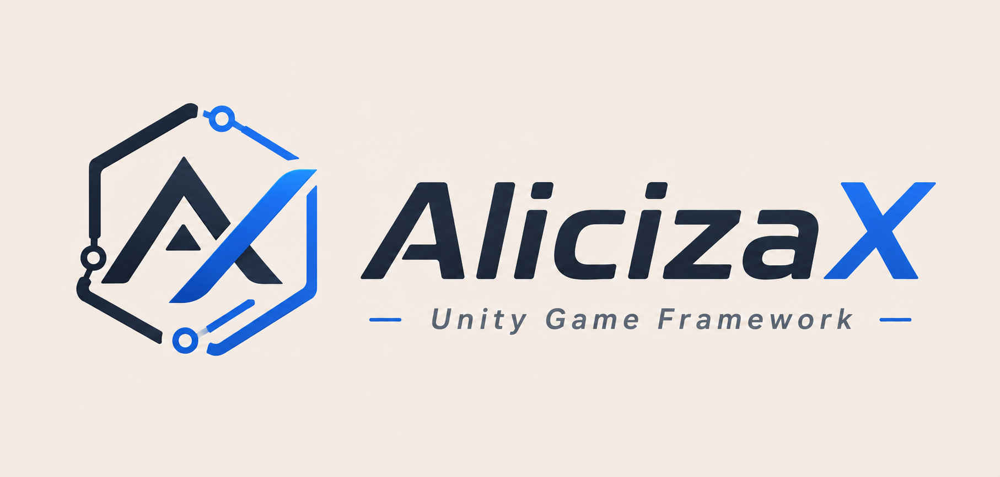

<div align="center">



[](https://unity.com/)
[](https://github.com/AlicizaX/AlicizaXTemplate)
[](https://github.com/AlicizaX/AlicizaXTemplate/issues)
[](https://github.com/AlicizaX/AlicizaXTemplate)

</div>

## 📖 简介

**AlicizaX** 是一套为商业化项目打造的 **Unity 工程模板**。  
它基于 **HybridCLR + YooAsset** 构建，提供从资源管理、UI 架构到热更新的全链路解决方案。

🚀 **核心优势：**
- **极致性能**：集成 0 GC 事件系统与四级时间轮计时器，从容应对高并发场景。
- **工程友好**：模块清晰、边界明确，支持按需裁剪，无侵入式设计便于二次开发。
- **开箱即用**：封装了对象池、虚拟列表、多端输入等常用组件，大幅降低业务层复杂度。
- 
## ✨ 核心能力

| 模块 | 核心价值 | 亮点特性 |
| :--- | :--- | :--- |
| **📡 Event**<br>事件系统 | **0 GC 高频通信** | 无堆分配设计 · 自动解绑 · 轻松应对战斗同步与万级派发 |
| **⏱️ Timer**<br>时间轮 | **极致性能计时** | 四级时间轮算法 · 无全量扫描 · 精准承载技能 CD / 心跳 / 延时任务 |
| **🧠 MemoryPool**<br>内存池 | **低 GC 引用管理** | 分页 Slab 架构 · 句柄校验 · 动态容量策略 · 内存与性能平衡 |
| **🏭 ObjectPool**<br>对象池 | **全生命周期管控** | 分页槽位管理 · 支持锁定/多Spawn · 低内存清理 · 帧预算释放 |
| **📦 Resources**<br>资源服务 | **智能缓存策略** | 基于 YooAsset · 资源租约 · 热资源保活 · 闲置回收 · 高缓存命中率 |
| **🔥 HybridCLR**<br>热更新 | **无缝 C# 热更** | AOT / Hotfix 分层 · 内置反射调用示例 · 资源与代码一体化流程 |
| **🎨 UI**<br>界面系统 | **高效窗口管理** | 窗口栈与层级 · Holder 自动生成 · Widget / Tab 复用 · 逻辑视图分离 |
| **📜 RecyclerView**<br>虚拟列表 | **海量数据承载** | 可见区增量刷新 · 支持循环/分组/网格/分页/圆形布局 · 惯性滚动 |
| **🕹️ UI Extension**<br>UI 扩展 | **开箱即用组件** | 强封装 Button/Switch/Image · 拖拽导航 · 多端输入图标 · 减少胶水代码 |
| **⌨️ Navigation**<br>导航热键 | **多设备输入** | 基于 New Input System · 自动设备识别 · 顶层焦点域 · 热键转发 |
---

# 🚀 新工程安装指南

### 1️⃣ 安装 Framework Installer
在 **Unity Package Manager** 中，通过 Git URL 添加安装器：

```text
https://github.com/AlicizaX/FramworkInstaller.git
```

---

### 2️⃣ 启动安装器
安装完成后，在顶部菜单栏点击：

> **`AlicizaX / Installer`**

🔧 **自动配置**：安装器将自动检测并补齐所需的 **OpenUPM Scoped Registry** 及 **Scopes**。

---

### 3️⃣ 安装核心库 (Core)
点击 **`Install Core`** 按钮，安装核心依赖：

```text
com.alicizax.unity.framework
```

✅ 安装成功后，模板入口将自动解锁。

---

### 4️⃣ 选择项目模板
根据你的项目需求，选择并导入对应模板：

| 模板类型 | 适用场景 |
| :--- | :--- |
| **Normal** | 标准项目开发 |
| **Hybrid** | 混合开发模式 |

---


# 📖 文档中心

### 🏁 入门与基础
- **[🚀 QuickStart 快速入门](Books/QuickStart.md)** —— *启动链路、资源初始化、热更入口*
- **[🧩 Service 服务](Books/Service.md)** —— *服务容器、生命周期、Tick 驱动*
- **[🔄 Procedure 流程](Books/Procedure.md)** —— *状态机、启动流程、异步写法*
- **[🐞 Debugger 调试](Books/Debugger.md)** —— *运行时面板与自定义窗口*

### 📦 资源与对象
- **[📂 Resources 资源](Books/Resources.md)** —— *YooAsset 加载、下载、回收策略*
- **[🏭 GameObjectPool](Books/GameObjectPool.md)** —— *实例池与生命周期*
- **[🧠 MemoryPool](Books/MemoryPool.md)** —— *引用对象池、容量管理*

### 🎮 业务模块
- **[🎨 UI 系统](Books/UI.md)** —— *窗口栈、Widget、Tab、事件管理*
- **[🔊 Audio 音频](Books/Audio.md)** —— *音效、音乐、3D 声音*
- **[🌐 Scene 场景](Books/Scene.md)** —— *加载、挂起、激活、卸载*
- **[🌍 Localization 本地化](Books/Localization.md)** —— *多语言表与动态切换*
- **[⏱️ Timer 计时器](Books/Timer.md)** —— *时间轮、延迟、循环、暂停*
- **[📡 Event 事件](Books/Event.md)** —— *0 GC 事件总线*

### 🧩 UI 扩展包 (`com.alicizax.unity.ui.extension`)
- **[📖 扩展包概览](Books/Extension/README.md)**
- **[🕹️ UX 组件](Books/Extension/UXComponent.md)** —— *按钮、开关、图标、交互*
- **[📜 RecyclerView](Books/Extension/RecyclerView.md)** —— *虚拟列表、循环布局*
- **[⌨️ InputGlyph](Books/Extension/InputGlyph.md)** —— *按键映射与设备识别*

---
```text

# 📁 项目结构
Aliciza/
├── Books/                         # 框架文档和图片资源
│   └── Extension/                 # UI 扩展包文档
├── Client/                        # Unity 客户端工程
│   └── Assets/
│       ├── Art/                   # 美术资源
│       ├── Bundles/               # 热更资源目录
│       │   ├── Audios/            # 音频资源
│       │   ├── Configs/           # 配置和本地化资源
│       │   ├── DLL/               # 热更程序集资源
│       │   ├── Scenes/            # 资源场景
│       │   ├── UI/                # UI 预制体
│       │   └── UIRaw/             # UI 原始图片资源
│       ├── Editor/                # 项目编辑器脚本
│       ├── HybridCLRGenerate/     # HybridCLR 生成内容
│       ├── Scenes/                # 启动场景
│       ├── Scripts/
│       │   ├── Startup/           # AOT 启动程序集
│       │   └── Hotfix/            # 热更程序集
│       │       ├── GameBase/
│       │       ├── GameLib/
│       │       ├── GameLogic/
│       │       └── GameProto/
│       └── YooAsset/              # YooAsset 配置
└── Config/                        # 配置表工程
```

# 🤝 贡献与致谢

<div style="display: flex; justify-content: space-between; flex-wrap: wrap;">

<div style="flex: 1; min-width: 250px; margin-right: 20px;">

**🌟 生态依赖**
- **[TEngine](https://github.com/Alex-Rachel/TEngine)** —— *设计基石性能强大、易用、设计优秀 上手使用很方便 有多款已上线商业项目验证 ⭐⭐⭐⭐⭐
- **[YooAsset](https://github.com/tuyoogame/YooAsset)** —— *资源管理*
- **[HybridCLR](https://github.com/focus-creative-games/hybridclr)** —— *热更新方案*
- **[Luban](https://github.com/focus-creative-games/luban)** —— *配置解决方案*

</div>
<div style="flex: 1; min-width: 250px;">

**👥 贡献者**
[](https://github.com/AlicizaX/AlicizaXTemplate/graphs/contributors)

**💡 参与贡献**
欢迎提交 Issue 或 PR。提交前建议说明问题背景与改动范围。

</div>

</div>
